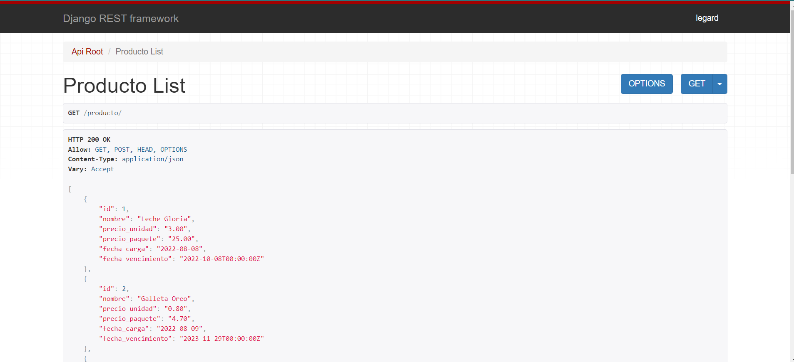
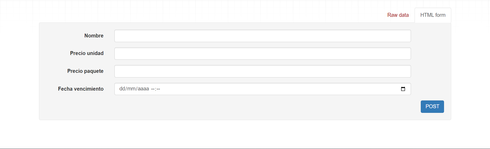
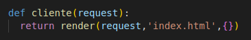
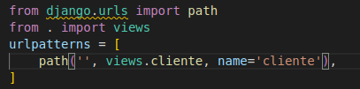
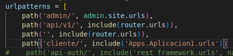
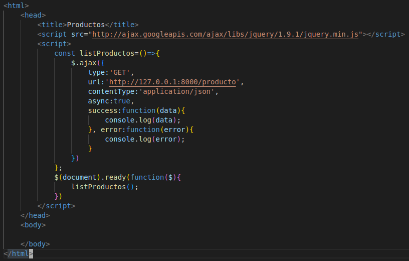
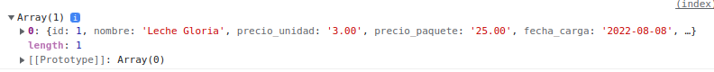
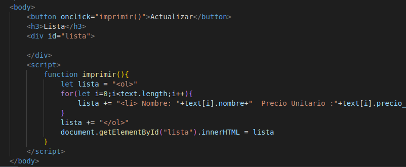
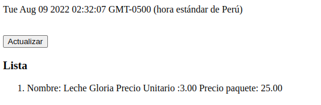

<table>
<theader>
<tr>
<td></td>
<th>
UNIVERSIDAD NACIONAL DE SAN AGUSTIN 
FACULTAD DE INGENIERÍA DE PRODUCCIÓN Y SERVICIOS 
ESCUELA PROFESIONAL DE INGENIERÍA DE SISTEMAS
</th>
<td></td>
</tr>
</theader>
<tbody>
<tr><td colspan="3">Formato: Guía de Práctica de Laboratorio</td></tr>
<tr><td>Aprobación:  2022/03/01</td><td>Código: GUIA-PRLD-001</td><td>Página: 1</td></tr>
</tbody>
</table>

<h3>INFORME DE LABORATORIO</h3>

<table>
<theader>
<tr><th colspan="6" bgcolor="red">INFORMACIÓN BÁSICA</th></tr>
</theader>
<tbody>
<tr><td>ASIGNATURA:</td><td colspan="5">Programación Web 2</td></tr>
<tr><td>TÍTULO DE LA PRACTICA:</td><td colspan="5"> DJANGO - REST</td></tr>
<tr><td>NÚMERO DE PRÁCTICA:</td><td>Practica de Laboratorio 07</td><td>AÑO LECTIVO:</td><td>2022 A</td><td>NRO. SEMESTRE:</td><td>III</td></tr>
<tr><td>FECHA DE PRESENTACIÓN:</td><td>09/08/2022</td><td>HORA DE PRESENTACIÓN:</td><td colspan="3">11:30 p.m.</td></tr>
<tr><td>INTEGRANTES:</td><td colspan="3">- Edson Joel López Quispe - Gabriel Steven Machicao Quispe - Fernando Coyla Alvarez</td><td>NOTA:</td><td>...</td></tr>
<tr><td>DOCENTE:</td><td colspan="5">Richart Smith Escobedo Quispe - rescobedoq@unsa.edu.pe</td></tr>
</tbody>
</table>
<table>
<theader>
<tr><th>SOLUCIÓN Y RESULTADOS</th></tr>
</theader>
<tbody>
<tr><td>I. SOLUCIÓN DE EJERCICIOS/PROBLEMAS:
<h2><strong>Creación del servidor</strong></h2>
<h3>DJANGO REST FRAMEWORK</h3>
Se hace el seguiminto de este tutorial: 
<a href="https://www.django-rest-framework.org/">Django Rest</a> 
En el cual se hecho los pasos correspondiente para crear esta <em>API</em> la cual implementa respuestas en JSON de los usuarios que tiene el DJANGO en dispoción, por lo cual se hizo otro modelo de datos en la carpeta <strong>Apps/Aplicacion1</strong> donde se realizó en el archivo models.py lo siguien:
<pre>
from django.db import models
from django.contrib.auth.models import User

class Producto(models.Model):
    nombre = models.CharField(max_length=100)
    precio_unidad = models.DecimalField(decimal_places=2,max_digits=5)
    precio_paquete = models.DecimalField(decimal_places=2,max_digits=5)
    fecha_carga = models.DateField(auto_now=True)
    fecha_vencimiento =         models.DateTimeField();
</pre>
En cual estos atributos seran serializados por el documento serializers.py donde por medio del siguiente código permite usar estos datos a través de views.py
<pre>
from .models import Producto
from rest_framework import serializers

class ProductoSerializer(serializers.ModelSerializer):
  class Meta:
    model = Producto
    fields = '__all__'
</pre>
Luego en las views.py se le da la vista que va tener los datos a traves de la clase y para el cliente a trave de un método envia los datos para que los use:
<pre>
from .models import Producto
from .serializers import ProductoSerializer
from rest_framework import viewsets
from django.shortcuts import render

class ProductoViewSet(viewsets.ModelViewSet):
  queryset = Producto.objects.all()
  serializer_class = ProductoSerializer
# Create your views here.
def cliente(request):
  return render(request,'index.html',{})(aux)
</pre>
Luego en la carpeta <strong>Proyecto/</strong> se busca el archivo urls.py para modificar las urls.py donde se innova los métodos de las anteriores archivos
<pre>
from django.contrib import admin
from django.urls  import path, include
from django.contrib.auth.models import User
from rest_framework import routers, serializers, viewsets
from Apps.Aplicacion1 import views

router = routers.DefaultRouter()
router.register('producto', views.ProductoViewSet)
# Additionally, we include login URLs for the browsable API.
urlpatterns = [
    path('admin/', admin.site.urls),
    path('api/v1/', include(router.urls)),
    path('', include(router.urls)),
    path('cliente/', include('Apps.Aplicacion1.urls'))
</pre>
En este código toma en cuenta también una url donde puede usar los datos que tiene en la base de datos; Quedando el siguiente resultado: 
 
Esta página también cuenta con el envio de los datos de forma post a traves de un formulario de html que se observa a continuación: 
 
Para probar que el servicio funciona se hace el uso de <strong>SoapUI</strong>, este programa hace la petición y el servicio API le dio la siguiente respuesta. 
 
Demostrando que el servicio API esta listo para ser usado por un cliente.
<h2><strong>Creación del cliente (GET)</strong></h2>
<h3>1. Creación de la vista </h3>
La vista se crea en el archivo <em>views.py</em> en la ruta Apps/Aplicación1 
 
La vista se escribe en forma de función, basicamente renderiza el archivo index.html, que se procedera a crear posteriormente
<h3>2. Creación de la ruta de la vista</h3>
Se crea el archivo <em>urls.py</em> en la ruta Apps/Aplicación1 y se escribe los siguiente 
 
Este código le asigna una ruta a la vista previamente creada.
Posteriormente se edita el archivo <em>urls.py</em> de Proyecto 

<h3>3. Creación del archivo<em>index.html</em></h3>
Para esto se crea una carpeta <em>templates</em> en la ruta Apps/Aplicación1 
<h3>4. Creación de la petición Ajax </h3>
 
A travéz del método Get se le hace la petición al url que dejo el Rest y se imprime en consola en forma de Array 
 
Se agrega contenido al html 
 
Asi se veria la parte del cliente 
 
  </td></tr>
</tbody>
</table>

<table>
<theader>
  <tr><td>RETROALIMENTACIÓN GENERAL</td> <tr>
</theader>
<tbody>
  <tr><td>
...
</td></tr>
</tbody>
</table>

<table>
<theader>
<tr><td>REFERENCIAS Y BIBLIOGRAFÍA</td><tr>
</theader>
<tbody>
<tr><td>[1] "Home - Django REST framework". Home - Django REST framework. https://www.django-rest-framework.org/. 
[2] "jQuery AJAX get() and post() Methods". W3Schools Online Web Tutorials. https://www.w3schools.com/jquery/jquery_ajax_get_post.asp. 
[3] "API con Django Rest Framework | Django | Academia | Hektor Profe". Documentos | Hektor Profe | Formación sobre Python y Unity.  <https://docs.hektorprofe.net/academia/django/api-rest-framework/.</tr></td>
</tbody>
</table>
